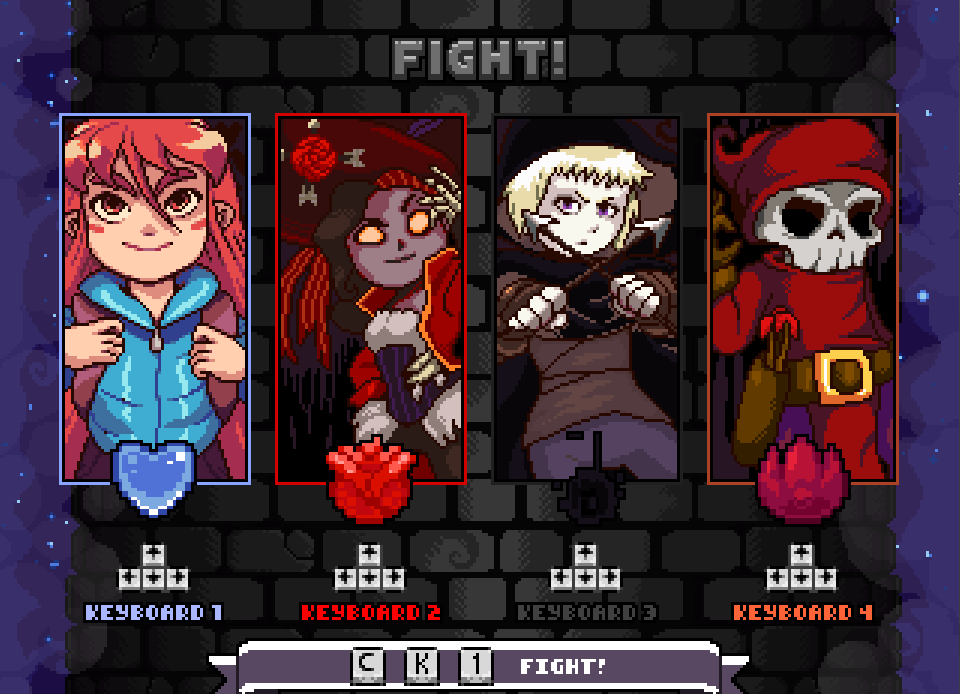
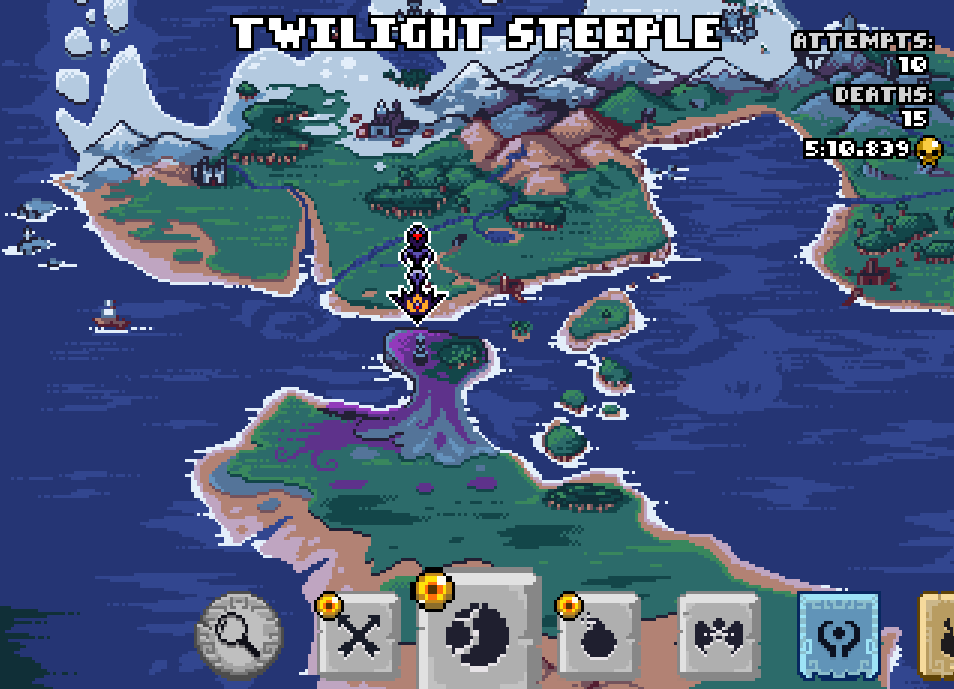
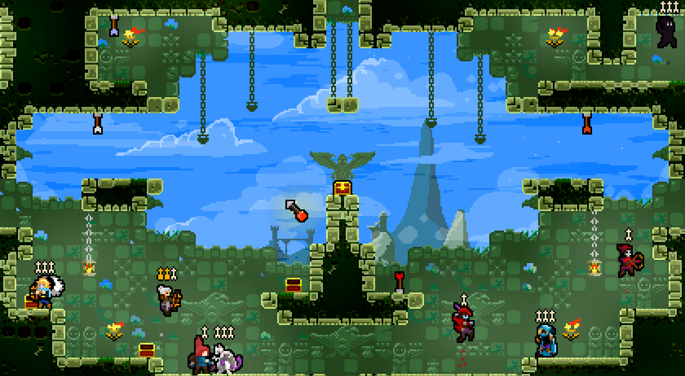
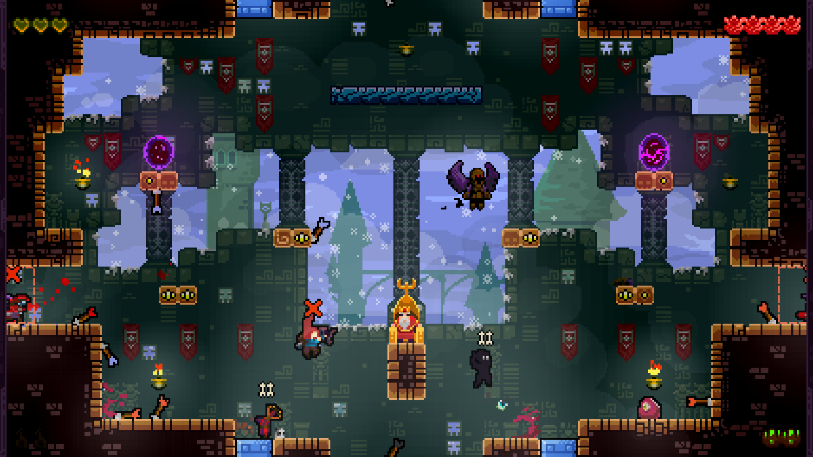

# FortRise - TowerFall Mod Loader
It's a mod loader for [TowerFall Dark World](http://www.towerfall-game.com/) (created by Maddy Thorson). It's using [MonoMod](https://github.com/MonoMod/MonoMod) an open-source C# modding utility.

### Installation
+ Go to the Releases page, and download the FortRise-Installer in zip file.
+ Extract all of the contents and launch the Installer.exe. You will be opening a interactive command line application.
+ + For NoANSI mode, open your terminal, type `Installer.exe --patch <Path to TowerFall>` to do install and patch TowerFall. Then skip the next step.
+ Press enter on `Patch` selection, and find and select your TowerFall directory, usually in `C:/Program Files (x86)/Steam/steamapps/common/TowerFall`.
+ Then it would prompt you that you want to patch this directory, then say yes. It will copy and create necessary files to get the mod running.
+ It will prompt you if you want to use Debug Mode, say no if you don't want to use Debug Mode, otherwise if you are a mod developer, say yes.
+ And, it's done! Launch TowerFall and it should have a mods section in main menu.

### Mod Installation
+ For installing a mod, you must create a directory called `Mods`.
+ Then create a folder inside of it and name what it represent the mod is.
+ Paste all of the mod content and done.
+ Launch TowerFall to see the changes.

### Creating mods
For creating mods, check out [Creating Mods in the wiki](https://github.com/Terria-K/FortRise/wiki/Creating-Mods), for more information.

## Troubleshooting
### The game crashes before it even loads! (Windows only)
If the game crashes before loading, or you see an error in the log file that says `An attempt was made to load an assembly from a network location which would have caused the assembly to be sandboxed in previous versions of the .NET Framework.` on Windows, right click for each DLLs on the root directory, click Properties, and hit the unblock checkbox at the bottom. You might also need to unblock every DLLs of the mod you've installed inside of the Mods folder.

### Mods Created in FortRise
## [Archer Loader](https://github.com/RedDude/ArcherLoader/releases/)
### By: [RedDude](https://github.com/RedDude)
Add Custom Archers for Towerfall easily by just Drag n Drop and create Archers with custom hair, wings, ghost, particles, layers and even taunts and skins for archers.

## [TF.EX (TowerFall NetPlay WIP)](https://github.com/Fcornaire/TF.EX)
### By: [DShad]
TF EX is a mod that attempt to bring netplay to TowerFall (EX as a Fighting game EX move, usually costing meter).

## Adventure
### By: [Terria](https://github.com/Terria-K)
Loads custom Dark World levels with workshop-like button without having to mess around with original game files.

## [Eight-Player Mode (WIP)](https://github.com/Terria-K/EightPlayerMod)
### By: [Terria](https://github.com/Terria-K) and [RedDude](https://github.com/RedDude)
Ported 8P mode as a FortRise mod with wider level set and additional Co-Op wide quest.

## [Oops! All Arrwos Mod](https://github.com/CoolModder/Towerfall-Redemption/releases/tag/v3.1.0-Arrows)
### By: [CoolModder](https://github.com/CoolModder)
Enjoy the chaos of ten new arrows, with more on the way!

## Roadmap
Check the [roadmap](./ROADMAP.md) for planned features.
